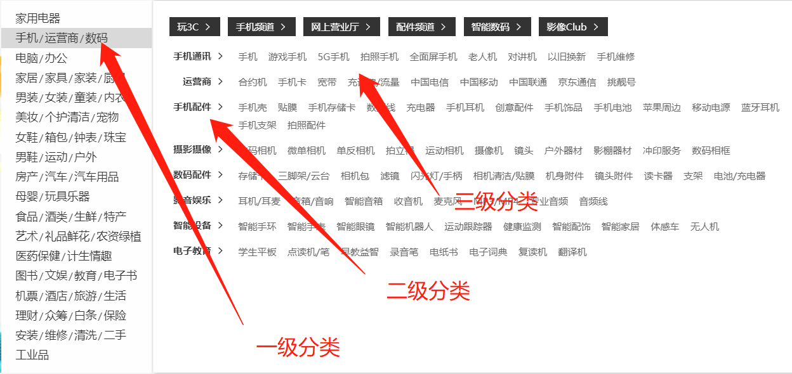
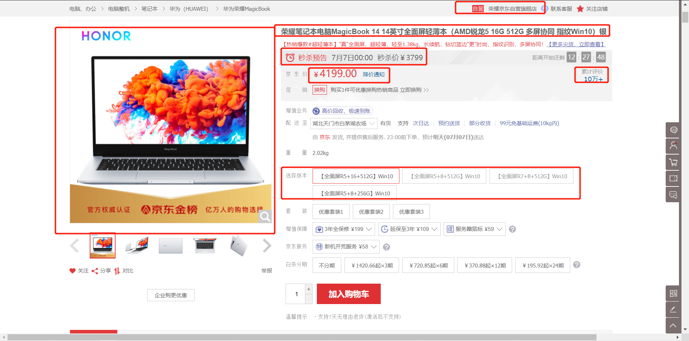
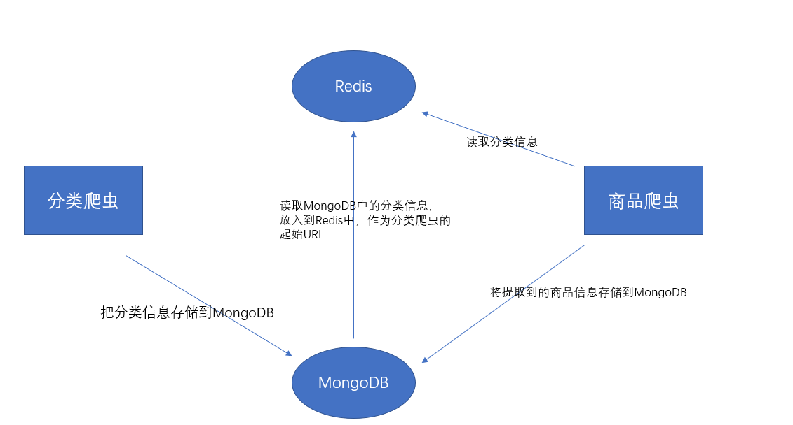
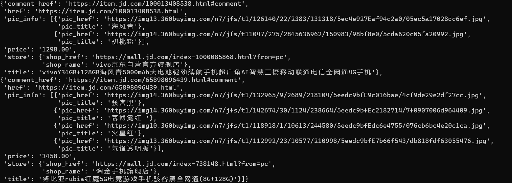
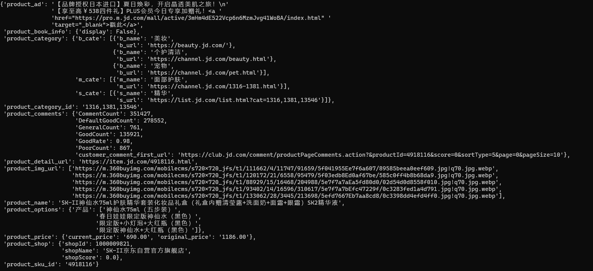
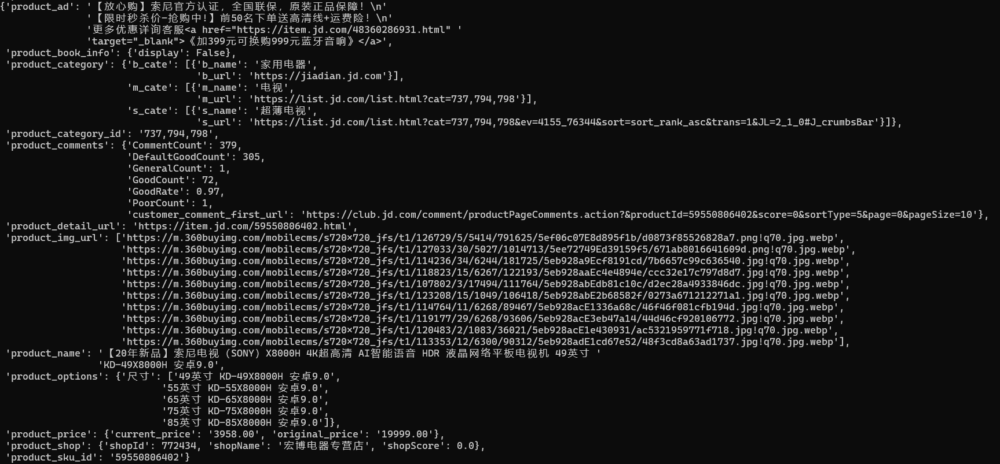
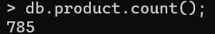
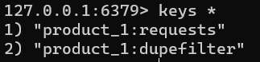

## 1、京东全网爬虫需求

#### 1.1 目标

* 明确要抓取的信息

#### 1.2 目标分解

##### 1.2.1 抓取首页的分类信息

* 抓取数据：各级分类的`名称`和`URL`

  

  * 大分类名称和url
  * 中分类名称和url
  * 小分类名称和url

##### 1.2.2 抓取商品信息

* 抓取数据

  

  * 商品名称
  * 商品价格
  * 商品评论数量
  * 商品店铺
  * 商品促销
  * 商品版本
  * 商品图片的ULR

## 2、开发环境与技术选择

* 平台：window+Linux
* 开发语言：python3
* 开发工具：pycharm
* 技术选择：
  * 属于全网爬虫，抓取的页面非常多，考虑到效率，使用scrapy+scrapy_redis
  * 数据量很多，选择MongoDB

## 3、京东全网爬虫实现步骤

* 广度优先策略，将类别和商品信息的抓取分开
  * 优点：逐步实现，高稳定性

##### 3.1 总体设计



##### 3.2 实现步骤

* 1.创建爬虫项目
* 2.根据需求，定义数据模型
* 3.实现分类爬虫
* 4.保存分类信息
* 5.实现商品爬虫
* 6.保存商品信息
* 7.实现随机User-Agent和代理IP下载器中间，解决IP反爬

## 4、数据模型

##### 4.1 类别数据模型

* 类别数据模型类（Category(scrapy.Item)）：用于存储类别信息字段

  * b_cate
    * b_cate_name：大类别名称
    * b_cate_url：大类别url
  * m_cate
    * m_cate_name：中类别名称
    * m_cate_url：中类别url
  * s_cate
    * s_cate_name：小类别名称
    * s_cate_url：小类别url

* 代码

  ```python
  class Category(scrapy.Item):
      b_cate = scrapy.Field()
      m_cate = scrapy.Field()
      s_cate = scrapy.Field()
  ```

##### 4.2 商品数据模型

* 商品数据模型类（Product(scrapy.Item)）：用于存储商品信息字段

  * product_category:商品类别
  * product_sku_id:商品ID
  * product_name:商品名称
  * product_img_url:商品图片url
  * product_options:商品版本
  * product_shop:商品店铺
  * product_comments:商品评论数量
  * product_ad:商品促销信息
  * product_price:商品价格
  * product_book_info:图书信息，作者，出版社

* 代码：

  ```python
  class Product(scrapy.Item):
      product_category = scrapy.Field()
      product_sku_id = scrapy.Field()
      product_name = scrapy.Field()
      product_img_url = scrapy.Field()
      product_price = scrapy.Field()
      product_options = scrapy.Field()
      product_shop = scrapy.Field()
      product_comments = scrapy.Field()
      product_ad = scrapy.Field()
      product_book_info = scrapy.Field()
  
  ```

  

## 5、分类爬虫

##### 5.1 确定目标url

* 目标：确定分类信息的url
* 步骤：
  * 进入到京东主页
  * 右击检查，全局搜索分类信息，如“超薄电视”
  * 确定分类的url：“https://dc.3.cn/category/get”
* url分析
  * get请求
  * 查询参数：
    * callback: getCategoryCallback

##### 5.2 创建爬虫

* 创建爬虫

  * `scrapy genspider cate jd.com`

* 指定起始url

  * `https://dc.3.cn/category/get`

* 解析数据，交给引擎

  * 编码分析

    * 返回数据编码为‘GBK’

  * url分析

    有三类数据格式

    * 1316-1381|面部护肤||0
      * 拼接url:	“https://channel.jd.com/1620-1625.html”
      * 带有一个`-`的字符，需要拼接“https://channel.jd.com/{}.html”
    * list.jd.com/list.html?tid=1008668|游戏手机||0
      * 完整的url，都带有`jd.com`字符,不需要替换或拼接
    * 1316-1381-1392|面膜||0
      * 拼接url:“https://list.jd.com/list.html?cat=737,794,13701”，并且将`-`替换为`,`
      * 有两个`-`的字符，需要将`-`替换为`,`，且添加字符`https://list.jd.com/list.html?cat=`

* 代码

  ```python
  import scrapy
  import json
  from jingdong.items import Category
  
  
  class CateSpider(scrapy.Spider):
      name = 'cate'
      allowed_domains = ['dc.3.cn']
      start_urls = ['https://dc.3.cn/category/get']
  
      def get_name_and_url(self, cate_info, cate_name, cate_url):
          cate = list()
          if isinstance(cate_info, list):
              for _ in cate_info:
                  item = dict()
                  item[cate_name] = _.split(r'|')[1]
                  url = _.split(r'|')[0]
                  if 'jd.com' in url:
                      item[cate_url] = "https://" + url
                  elif url.count("-") == 1:
                      item[cate_url] = 'https://channel.jd.com/{}.html'.format(url)
                  elif url.count("-") == 2:
                      item[cate_url] = 'https://list.jd.com/list.html?cat={}'.format(url.replace('-', ','))
                  cate.append(item)
              return cate
          if isinstance(cate_info, str):
              item = dict()
              item[cate_name] = cate_info.split(r'|')[1]
              url = cate_info.split(r'|')[0]
              if 'jd.com' in url:
                  item[cate_url] = "https://" + url
              elif url.count("-") == 1:
                  item[cate_url] = 'https://channel.jd.com/{}.html'.format(url)
              elif url.count("-") == 2:
                  item[cate_url] = 'https://list.jd.com/list.html?cat={}'.format(url.replace('-', ','))
              cate.append(item)
              return cate
  
      def get_info_from_s(self, data):
          n_cate_list = list()
          s_cate_list = list()
          if isinstance(data, list):
              for _ in data:
                  # 获取单个条目下的数据
                  name = _['n']
                  info = _["s"]
                  if name:
                      n_cate_list.append(name)
                  if info:
                      s_cate_list.append(info)
              return n_cate_list, s_cate_list
          if isinstance(data, dict):
              name = data['n']
              info = data["s"]
              if name:
                  n_cate_list.append(name)
              if info:
                  s_cate_list.append(info)
              return n_cate_list, s_cate_list
  
      def parse(self, response):
          result = json.loads(response.body.decode("GBK"))
          data_list = result.get('data')
          for data in data_list:
              # 获取单个大分类
              category_info = Category()
              # 获取包含分类的数据
              s_data = data['s']
              b_n_cate_list, b_s_cate_list = self.get_info_from_s(s_data)
              category_info["b_cate"] = self.get_name_and_url(b_n_cate_list, "b_name", "b_url")  # 获取到大分类信息
              for m_ in b_s_cate_list:
                  for m__ in m_:
                      m_n_cate_str = m__["n"]
                      category_info["m_cate"] = self.get_name_and_url(m_n_cate_str, "m_name", "m_url")  # 获取到中分类信息
                      m_s_cate_list = m__['s']
                      for s_ in m_s_cate_list:
                          s_n_cate_str = s_['n']
                          category_info["s_cate"] = self.get_name_and_url(s_n_cate_str, 's_name', 's_url')
                          yield category_info
  
  ```

  

## 6、保存分类数据

* 目标：把分类信息保存到MongoDB中
* 步骤：
  * 实现保存分类的`CategoryPipeline`类
  * 在`settings.py`中开启

##### 6.1 实现保存分类的Pipeline类

* 步骤：

  * `open_spider`方法中，链接MongoDB数据库，获取要操作的集合
  * `close_spider`方法中，关闭MongoDB数据库
  * `process_item`方法中，向MongoDB插入数据

* 代码

  ```python
  from pymongo import MongoClient
  from jingdong.settings import MONGO_URL
  
  
  class CategoryPipeline(object):
      def open_spider(self, spider):
          if spider.name == 'cate':
              self.mongo_client = MongoClient(MONGO_URL)
              self.category = self.mongo_client['jingdong']["category"]
  
      def close_spider(self, spider):
          if spider.name == "cate":
              self.mongo_client.close()
  
      def process_item(self, item, spider):
          if spider.name == 'cate':
              self.category.insert_one(dict(item))
              return item
  ```

##### 6.2 在settings.py中开启

```python
ITEM_PIPELINES = {
   'jingdong.pipelines.CategoryPipeline': 300,
}
```

## 7、商品爬虫

* 把MongoDB中存储的分类信息，放到redis_key中指定的列表中
* 支持分布式爬虫，当然也可以在一台电脑上运行多次，以启动多个进程，充分利用CPU的多核


##### 7.1 方案一

* 起始url为search入口，即该网页输入框API

  * 起始url:“https://search.jd.com/Search?keyword=%E6%B8%B8%E6%88%8F%E6%89%8B%E6%9C%BA&qrst=1&stock=1&page=1”
  * 从MongoDB中读取小分类名称，并parse.quote为url格式，替换keyword关键字
  * 将起始url放入redis队列中

* 构造下页url

  * base_url:”https://search.jd.com/s_new.php?keyword={}&s=30&page=1”
  * 替换其中的keyword关键字

* 此方案直接从XML中获取数据，用re或xpath提取，过于繁琐，但是能够拿到详情页数据，包括商品名称及商品URL，商品价格，商品图片URL，店铺及店铺URL

* 缺点

  * 可能未兼容所有的商品，比如兼容手机，其他普通商品，但是书籍需要的信息不全面

* spider代码

  ```python
  import scrapy
  import re
  from pprint import pprint
  
  
  class ProductSpider(scrapy.Spider):
      name = 'product'
      allowed_domains = ['jd.com']
      start_urls = ['https://search.jd.com/Search?keyword=%E6%B8%B8%E6%88%8F%E6%89%8B%E6%9C%BA&qrst=1&stock=1&page=1']
  
      def parse(self, response):
          html_str = response.body.decode()
          page_info = dict()
          # 获取页面总数
          page_count = re.compile(r'page_count:\"(.*?)\"', re.S).findall(html_str)
          page_info["page_count"] = int(page_count[0]) if page_count else None
          # 获取页面当页数
          page_current = re.compile(r'page:"(.*?)",page_count', re.S).findall(html_str)
          page_info["page_current"] = int(page_current[0]) if page_count else None
          # 获取所有的产品信息
          page_info["product_list"] = list()
          product_info_list = re.compile(r'class="p-img"(.*?)class="p-icons"', re.S).findall(html_str)
          ## 获取单个产品的信息
          for one_product_info in product_info_list:
              info = dict()
              # 获取标题及链接
              str_ = re.compile(r'p-name p-name-type-2(.*?)</div>', re.S).findall(one_product_info)[0]
              title = re.compile(r'em>(.*?)</em>', re.S).findall(str_)
              info["title"] = re.sub(r'\n|\t|\s|(<.*?>)', '', title[0]).strip() if title else None
              href = re.compile(r'href="(.*?)"', re.S).findall(str_)
              info["href"] = "https:" + href[0] if href else None
              # 获取价格
              str_ = re.compile(r'class="p-price"(.*?)</div>', re.S).findall(one_product_info)[0]
              price = re.compile(r'i>(.*?)</i>', re.S).findall(str_)
              info["price"] = price[0] if price else None
              # 获取图片
              info["pic_info"] = list()
              img_list = re.compile(r'class="ps-item">(.*?)</li>', re.S).findall(one_product_info)
              if img_list:
                  for img in img_list:
                      pic_info_ = dict()
                      pic_title = re.compile(r'title="(.*?)">', re.S).findall(img)
                      pic_info_["pic_title"] = pic_title[0] if pic_title else None
                      pic_href = re.compile(r'data-lazy-img="(.*?)"', re.S).findall(img)
                      pic_info_["pic_href"] = "https:" + pic_href[0] if pic_href else "---"
                      info["pic_info"].append(pic_info_)
              else:
                  pic_url = re.compile(r'data-img="1" src="(.*?)" data-lazy-img', re.S).findall(one_product_info)
                  img_url = "https:" + pic_url[0] if pic_url else "---"
                  info['pic_info'].append(img_url)
              # 获取评价连接
              info["comment_href"] = info["href"] + "#comment"
              # 获取售卖店铺及链接
              info["store"] = dict()
              str_ = re.compile(r'class="p-shop"(.*?)</div>', re.S).findall(one_product_info)[0]
              shop_name = re.compile(r'title="(.*?)"', re.S).findall(str_)
              info["store"]["shop_name"] = shop_name[0] if shop_name else None
              shop_href = re.compile(r'href="(.*?)"', re.S).findall(str_)
              info["store"]["shop_href"] = "https:" + shop_href[0] if shop_href else None
              # 将单个产品添加到产品列表
              page_info["product_list"].append(info)
          pprint(page_info)
          next_page = "page={}".format(int(page_info["page_current"])+1)
          keyword = re.findall(r'keyword=(.*?)&', response.url, re.S)[0]
          url_ = "https://search.jd.com/s_new.php?keyword={}&s=30&page=1".format(keyword)
          next_url = url_.split('page=')[0] + next_page
          if page_info['page_current']:
              while int(page_info['page_current']) <= int(page_info['page_count']):
                  yield scrapy.Request(
                      url=next_url,
                      callback=self.parse
                  )
  
  ```

* 数据展示

  

#####7.2 方案2

* 起始url为search入口，即该网页输入框API
  * 起始url:“https://search.jd.com/Search?keyword=%E6%B8%B8%E6%88%8F%E6%89%8B%E6%9C%BA&qrst=1&stock=1&page=1”
  * 从MongoDB中读取小分类名称，并parse.quote为url格式，替换keyword关键字
  * 将起始url放入redis队列中
* 构造下页url
  * base_url:”https://search.jd.com/s_new.php?keyword={}&s=30&page=1”
  * 替换其中的keyword关键字
* 解析html时，只拿商品skuid
* 通过手机app抓app包，用商品skuid获取商品json数据
  * `https://cdnware.m.jd.com/c1/skuDetail/apple/7.3.0/32426231880.json`
    * `m.jd.com/c1`中是c+阿拉伯数值的1
* PC端获取促销信息
  * 在商品详情页找到促销URL
    * 通过不同的商品界面（有促销，无促销），通过search_all找到关键url
    * url:`https://cd.jd.com/promotion/v2?skuId=30888651734&area=17_2980_23644_0&cat=670%2C729%2C4837`
  * 分析参数
    * skuid
    * area 固定
    * cat=类别（从app端，返回的json数据获取）
* PC端获取，确定评论信息的URL
  * url:
    * `https://club.jd.com/comment/productPageComments.action?&productId=12882834&score=0&sortType=5&page=0&pageSize=10`
  * 参数
    * **productId: 11941094** 
    * *score: 0 固定值必须*
    * *sortType: 5 固定值必须*
    * **page: 1 当前页数**
    * **pageSize: 10 固定值，每次返回的数据条数**
  * 注意page从0到99,数据中关键字`maxPage: 100`为总页数
  * 后期，可通过这个api与product_sku_id结合，单独来爬取评论信息
  * 另一个url
    * `https://club.jd.com/comment/productCommentSummaries.action?referenceIds=100010816812`
    * 参数
      * referenceIds即为商品IP
    * 获取数据
      * 全部评价：CommentCount
      * 默认好评：DefaultGoodCount
      * 好评：GooDCount
      * 中评：GeneralCount
      * 差评：PoorCount
      * 好评度：GoodRate
* PC端获取，确定商品价格信息的URL
  * url:`https://p.3.cn/prices/mgets?&skuIds=J_30888651734`
  * 价格在关键字中，包含现价和原价，打折信息
  * 参数：
    * productid:30888651734	商品ID

###### 7.2.1 实现爬虫

* 通过search这个api入口发送请求
  * 通过xpath得到sku_id
  * 构造下页请求
  
* 手机app抓包
  * 通过charles抓包，得到url
    * `https://cdnware.m.jd.com/c1/skuDetail/apple/7.3.0/32426231880.json`
    * get请求
    * 返回json数据
    * 参数
      * 商品的sku_id= `32426231880`
  
* 通过sku_id，构造请求

  * **注意：传递参数时，因为有for循环，如果不深拷贝的话，最后一个对象的product_sku_id会覆盖所有的对象，导致后面拿不到数据**

* 解析通过sku_id拿到的json数据，拿到：

  * product_name:商品名称

    * product[“product_name”]=data\[‘wareInfo’]\[‘basicInfo’]\[‘name’]

  * product_img_url:商品图片url

    * product[‘product_img_url’] = data\[‘wareInfo’]\[‘basicInfo’]\[‘wareImage’]

  * product_book_info:图书信息，作者，出版社

    * product[‘product_img_url’] = data\[‘wareInfo’]\[‘basicInfo’]\[‘bookInfo’]

  * product_options：商品选项

    ```python
    color_size= = jsonpath(data, '$..colorSize')
    if color_size:
        for s_ in color_size[0]:
            title = s_['title']
            buttons = jsonpath(s_,"$..text")
            product_options['title']=buttons
            
    ```

    

  * product_shop:商品店铺

    ```python
    shop = jsonpath.jsonpath(data, '$..shop')
    if shop:
        shop = shop[0]
        shopinfo = dict()
        if shop:
            shopinfo['shopId'] = shop['shopId']
            shopinfo['shopName'] = shop['name']
            shopinfo['shopScore'] = shop['score']
         else:
            shopinfo['shopName'] = "京东自营"
     	 product["product_shop"] = shopinfo
            
        
    ```

    

  * product_category_id：商品类别ID

    ```python
    product_category_id = data['wareInfo']['basicInfo']['category']
    ```

* 获取促销信息

  * url :	`https://cd.jd.com/promotion/v2?skuId=30888651734&area=17_2980_23644_0&cat=670%2C729%2C4837`

    * skuId为商品ip
    * area为固定值
    * cat为通过skuid获取到的类别id

    ```python
    data['ads']
    ```

* 获取价格信息

  * url : `https://p.3.cn/prices/mgets?&skuIds=J_30888651734`
  * 参数：
    * skuIds为商品ID
  * 注意
    * **价格的域名为`p.3.cn`，一定要添加到allowed_domains中，否则爬虫会自动过滤掉，导致拿不到价格数据**

* 获取评价

  * url: `https://club.jd.com/comment/productPageComments.action?&productId=12882834&score=0&sortType=5&page=0&pageSize=10`

* 最终效果



* 源码

  ```python
  import scrapy
  from urllib import parse
  from jingdong.items import ProductItem
  import re
  import json
  import jsonpath
  from copy import deepcopy
  from pprint import pprint
  
  
  class Product1Spider(scrapy.Spider):
      name = 'product_1'
      allowed_domains = ['jd.com', 'p.3.cn']
  
      # start_urls = ['https://search.jd.com/Search?keyword=%E6%B8%B8%E6%88%8F%E6%89%8B%E6%9C%BA']
  
      def start_requests(self):
          category = {
              'b_cate':
                  [
                      {'b_name': '美妆', 'b_url': 'https://beauty.jd.com/'},
                      {'b_name': '个护清洁', 'b_url': 'https://channel.jd.com/beauty.html'},
                      {'b_name': '宠物', 'b_url': 'https://channel.jd.com/pet.html'}],
              'm_cate':
                  [
                      {'m_name': '面部护肤', 'm_url': 'https://channel.jd.com/1316-1381.html'}],
              's_cate':
                  [
                      {'s_name': '精华', 's_url': 'https://list.jd.com/list.html?cat=1316,1381,13546'}]}
          yield scrapy.Request(
              url="https://search.jd.com/Search?keyword={}".format(parse.quote(category["s_cate"][0]['s_name'])),
              callback=self.parse,
              meta={"item": category}
          )
  
      def parse(self, response):
          product_category = response.meta['item']
          product = ProductItem()
          product['product_category'] = product_category
          html_str = response.body.decode()
          li_list = response.xpath('//div[contains(@id,"J_goodsList")]/ul/li')
          for li in li_list:
              sku_id = li.xpath('./@data-sku').extract_first()
              product['product_sku_id'] = sku_id
              product['product_detail_url'] = "https://item.jd.com/{}.html".format(sku_id)
              # 获取店铺信息，类别信息，版本，图片等
              request_url = "https://cdnware.m.jd.com/c1/skuDetail/apple/7.3.0/{}.json".format(sku_id)
              yield scrapy.Request(
                  url=request_url,
                  meta={"item": deepcopy(product)},
                  callback=self.parse_skuid_content
              )
          # 构造下页请求
          base_url = "https://search.jd.com/s_new.php?keyword={}&s=30&page=1"
          page_count = re.compile(r'page_count:\"(.*?)\"', re.S).findall(html_str)
          page_count = int(page_count[0]) if page_count else None
          page_current = re.compile(r'page:"(.*?)",page_count', re.S).findall(html_str)
          page_current = int(page_current[0]) if page_current else None
          next_page = "page={}".format(page_current + 1)
          keyword = parse.quote(product['product_category']['s_cate'][0]["s_name"])
          url_ = "https://search.jd.com/s_new.php?keyword={}&s=30&page=1".format(keyword)
          next_url = url_.split('page=')[0] + next_page
          if page_current and page_count:
              while page_current <= page_count:
                  yield scrapy.Request(
                      url=next_url,
                      meta={'item': product['product_category']},
                      callback=self.parse
                  )
  
      def parse_skuid_content(self, response):
          product = response.meta['item']
          data = json.loads(response.text)
          if 'wareInfo' in data:
              product['product_name'] = data['wareInfo']['basicInfo']['name']
              # data['wareInfo']['basicInfo']['wareImage']
              product['product_img_url'] = jsonpath.jsonpath(data, '$..wareImage..big')
              product['product_book_info'] = data['wareInfo']['basicInfo']['bookInfo']
              color_size = jsonpath.jsonpath(data, "$..colorSize")
              product_options = dict()
              if color_size:
                  for s_ in color_size[0]:
                      title = s_['title']
                      buttons = jsonpath.jsonpath(s_, '$..text')
                      product_options[title] = buttons
                  product['product_options'] = product_options
              shop = jsonpath.jsonpath(data, '$..shop')
              if shop:
                  shop = shop[0]
                  shop_info = dict()
                  if shop:
                      shop_info['shopId'] = shop['shopId']
                      shop_info['shopName'] = shop['name']
                      shop_info['shopScore'] = shop['score']
                  else:
                      shop_info['shopName'] = "京东自营"
                  product['product_shop'] = shop_info
              product['product_category_id'] = data['wareInfo']['basicInfo']['category'].replace(';', ',')
          # 获取促销信息
          ad_url = "https://cd.jd.com/promotion/v2?skuId={}&area=17_2980_23644_0&cat={}".format(product["product_sku_id"], product['product_category_id'])
          yield scrapy.Request(
              url=ad_url,
              meta={"item": product},
              callback=self.get_ad_info
          )
  
      def get_ad_info(self, response):
          product = response.meta['item']
          data = json.loads(response.text)
          product["product_ad"] = data["ads"][0]['ad']
          # 获取价格
          price_url = "https://p.3.cn/prices/mgets?&skuIds=J_{}".format(product['product_sku_id'])
          yield scrapy.Request(
              url=price_url,
              meta={'item': product},
              callback=self.get_price_info
          )
  
      def get_price_info(self, response):
          product = response.meta['item']
          data = response.json()
          price_info = dict()
          price_info['original_price'] = data[0]['m']
          price_info['current_price'] = data[0]['p']
          product['product_price'] = price_info
          # 获取评价
          comment_url = "https://club.jd.com/comment/productCommentSummaries.action?referenceIds={}".format(product['product_sku_id'])
          yield scrapy.Request(
              url=comment_url,
              meta={'item': product},
              callback=self.get_comment_info
          )
  
      def get_comment_info(self, response):
          product = response.meta['item']
          data = response.json()["CommentsCount"][0]
          comments_info = dict()
          comments_info['customer_comment_first_url'] = "https://club.jd.com/comment/productPageComments.action?&productId={}&score=0&sortType=5&page=0&pageSize=10".format(product['product_sku_id'])
          comments_info['CommentCount'] = data['CommentCount']
          comments_info['DefaultGoodCount'] = data['DefaultGoodCount']
          comments_info['GoodCount'] = data['GoodCount']
          comments_info['GeneralCount'] = data['GeneralCount']
          comments_info['PoorCount'] = data['PoorCount']
          comments_info['GoodRate'] = data["GoodRate"]
          product['product_comments'] = comments_info
          yield product
          # pprint(product)
  
  ```

##### 7.3 商品爬虫实现分布式

* 修改爬虫类

  * 继承RedisSpider

    * `from scrapy_redis.spiders import RedisSpider`

  * 指定redis_key

    * `redis_key = 'product_1:category'`

  * 把重写start_requests改为重写make_request_from_data

    ```python
        def make_request_from_data(self, data):
            # 根据redis中读取的数据构建请求
            category = pickle.loads(data)
            yield scrapy.Request(
                url="https://search.jd.com/Search?keyword={}".format(parse.quote(category["s_cate"][0]['s_name'])),
                callback=self.parse,
                meta={"item": category}
            )
    ```

* 在settings.py文件中配置scrapy_redis

  ```python
  # 配置scrapy_redis
  DUPEFILTER_CLASS = 'scrapy_redis.dupefilter.RFPDupeFilter'  # 指定去重类
  SCHEDULER = 'scrapy_redis.scheduler.Scheduler'  # 指定scheduler队列
  SCHEDULER_PERSIST = True   # 队列中内容持久化
  REDIS_URL = 'redis://127.0.0.1:6379/0'   # 指定redis的地址
  ```

* 将MongoDB中保存的分类信息，放入到爬虫redis_key的列表中

  * 在项目文件夹下创建`add_category_to_redis.py`文件

  * 实现方法`add_category_to_redis`

    * 链接MongoDB
    * 链接Redis
    * 读取MongoDB中分类信息，剔除`_id`项后，序列化，然后添加到商品爬虫指定的redis中的redis_key中，redis_key是一个列表
    * 关闭MongoDB

  * 代码

    ```python
    import sys
    
    sys.path.append('../')
    import pickle
    from pymongo import MongoClient
    from redis import StrictRedis
    from jingdong.settings import MONGO_URL, REDIS_URL
    from jingdong.spiders.product_1 import Product1Spider
    
    
    def add_category_to_redis():
        mongo_client = MongoClient(MONGO_URL)
        redis_client = StrictRedis.from_url(REDIS_URL)
        collection = mongo_client['jingdong']['category']
        cursor = collection.find()
        for cur_ in cursor:
            cur_.pop('_id')
            cur = pickle.dumps(cur_)
            redis_client.lpush(Product1Spider.redis_key, cur)
            break
        mongo_client.close()
        redis_client.close()
    
    
    if __name__ == "__main__":
        add_category_to_redis()
    
    ```

    

## 8、保存商品信息

* 写商品Pipeline

  * 代码

  ```python
  class ProductPipeline(object):
      def open_spider(self, spider):
          if spider.name == 'product_1':
              self.mongo_client = MongoClient(MONGO_URL)
              self.category = self.mongo_client['jingdong']["product"]
  
      def close_spider(self, spider):
          if spider.name == "product_1":
              self.mongo_client.close()
  
      def process_item(self, item, spider):
          if spider.name == 'product_1':
              self.category.insert_one(dict(item))
          return item
  ```

* 在settings中开启

## 9、下载器中间件

* user_agent中间件

  ```python
  class RandomUserAgent(object):
  
      def process_request(self, request, spider):
          if request.url.startswith("https://cdnware.m.jd.com"):
              request.headers['User-Agent'] = 'JD4iPhone/164880 (iPhone; iOS 12.1.2; Scale/2.00)'
          else:
              request.headers['User-Agent'] = random.choice(USER_AGENTS)
  ```

  

* 代理IP的中间件

  * 在middlewares.py中，实现ProxyMiddleware类

  * 实现process_request方法

    * 从代理池中获取一个随机的代理IP，需要指定代理IP的协议，和访问的域名
    * 设置给request.meta[‘proxy’]

  * 实现process_exception方法

    * 当请求出现异常的时候，代理池哪些IP在本域名下是不可用的

  * 代码

    ```python
    class ProxyMiddleware(object):
    
        def process_request(self, request, spider):
            # 通过代理池的api接口,获取满足要求的proxy
            # response = ...
            request.meta['proxy'] = response.content.decode()
            return None
    
        def process_exception(self, request, exception, spider):
            pass
    ```

  * 在settings.py中开启

## 10、总结

* 开启步骤：

  * 执行`scrapy crawl cate`获取分类信息，并将其存储MongoDB中
  * 执行`python cate_category_to_redis.py`将分类信息从MongoDB放入redis_key
  * 执行`scrapy crawl product_1`获取商品信息，并将其存入MongoDB中

* 效果

  

  

  

  